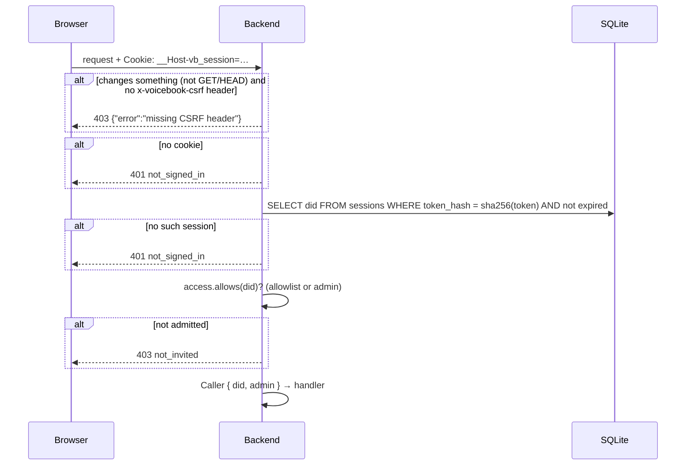

# Voicebook backend API

One page per endpoint: what it does, its parameters and responses, and a
sequence diagram of what happens behind it. The design behind authentication
is in [`../design/auth.md`](../design/auth.md); routing is in
`backend/src/api.rs`.

## Endpoints

| Endpoint | Auth | Page |
|---|---|---|
| `GET /api/health` | none | [health.md](health.md) |
| `GET /api/session` | none (reads the cookie if present) | [session-get.md](session-get.md) |
| `POST /api/session` | service-auth bearer token | [session-create.md](session-create.md) |
| `DELETE /api/session` | cookie, CSRF header | [session-delete.md](session-delete.md) |
| `GET /api/members` | session | [members.md](members.md) |
| `POST /api/members/{did}/refresh` | session (self or admin), CSRF header | [member-refresh.md](member-refresh.md) |
| `GET /api/users/{did}/recordings` | session | [user-recordings.md](user-recordings.md) |
| `GET /api/users/{did}/calendar` | session | [user-calendar.md](user-calendar.md) |
| `GET /api/users/{did}/friends/activity` | session | [user-friends-activity.md](user-friends-activity.md) |
| `POST /api/admin/reindex` | session (admin), CSRF header | [admin-reindex.md](admin-reindex.md) |
| `GET /client-metadata.json` | none | [client-metadata.md](client-metadata.md) |
| `GET /.well-known/did.json` | none | [did-document.md](did-document.md) |
| `GET /metrics` | none; separate, unpublished port | [metrics.md](metrics.md) |

Everything else on the main port serves the built frontend (single-page
app): unknown paths get `index.html`, except under `/api/` and `/metrics`,
which return 404.

## Conventions

**Authentication.** Protected endpoints need the session cookie, which
`POST /api/session` sets: `__Host-vb_session` over HTTPS, `vb_session` on
plain-HTTP loopback in local development (where `__Host-` cookies can't be
set). Over HTTPS the server reads only the `__Host-` name, which no other
subdomain can set. Before the handler runs, every protected request
goes through the same check (shown as *session check* in the diagrams):



On a 401, the frontend gets a new service-auth token, creates a new session
and retries once (`frontend/src/api.ts`).

**CSRF.** Requests that change something (anything but GET/HEAD) must send
`x-voicebook-csrf: 1`. There's no CORS, so other sites can't add it.

**Errors** are JSON: `{"error": "<code>"}`.

| Status | `error` | Meaning |
|---|---|---|
| 400 | a message | Malformed parameters |
| 401 | `not_signed_in` | No valid session (or, for `POST /api/session`, a bad token) |
| 403 | `not_invited` | The account isn't on the allowlist (caller or target) |
| 403 | `forbidden` | Signed in, but not allowed (e.g. admin-only) |
| 403 | `missing CSRF header` | See above |
| 404 | `not found` | Unknown `/api/` path |
| 500 | `internal error` | Details are only in the logs |

**Tracing.** API responses carry an `x-trace-id` header: the request's trace
ID, which finds it in the logs and in Tempo. Requests forwarded by nginx with
`X-Request-Id` record that too. See [`../design/logging.md`](../design/logging.md).

**DIDs in paths** are URL-encoded by the frontend (`did%3Aplc%3A…`); the raw
form works as well.

## Types

### Recording

Returned by the recordings and friends-activity endpoints, newest first.

```json
{
  "uri": "at://did:plc:wzraxbnzzz4fxt72jhvuswbb/club.voicebook.recording/3mx4no3nu4c22",
  "did": "did:plc:wzraxbnzzz4fxt72jhvuswbb",
  "handle": "alice.test",
  "createdAt": "2026-10-05T09:57:14.000Z",
  "work": "Pride and Prejudice",
  "chapter": "3",
  "durationMs": 3000,
  "notes": null,
  "mimeType": "audio/ogg; codecs=opus",
  "sizeBytes": 27360,
  "audioUrl": "https://pds.example/xrpc/com.atproto.sync.getBlob?did=did:plc:wzraxbnzzz4fxt72jhvuswbb&cid=bafkrei…"
}
```

- `createdAt` is UTC, normalized from the record.
- `audioUrl` points at the author's PDS: the browser fetches audio directly,
  and the backend never proxies it. Null if the author's PDS is unknown.
- `handle` is display data and may change; `did` is the identifier.

### Paging

`limit` (default 50, clamped to 1–200) and `before` (an RFC 3339 UTC
timestamp: only recordings created strictly before it). To page, pass the
last item's `createdAt` as `before`.
