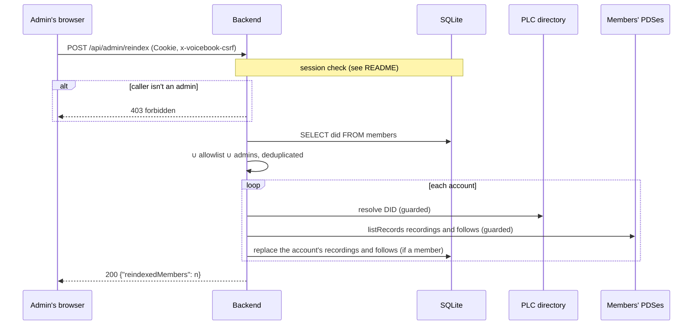

# `POST /api/admin/reindex`

Rebuilds the index from members' PDSes: refreshes every known member *and*
every account the config lists (`access.allowlist` and `access.admins`), one
after another. During the invite-only beta that list names everyone who can
be a member, so this recovers a lost index completely.

The backend also runs the same reindex by itself at startup on invite-only
instances (see `docs/mvp-local.md` §19).

- **Auth:** session from an admin (`access.admins`); `x-voicebook-csrf: 1`
  required.
- **Implemented in:** `reindex` in `backend/src/api.rs`;
  `Indexer::reindex_all` in `backend/src/indexer.rs`.

## Request

```http
POST /api/admin/reindex
Cookie: vb_session=…
x-voicebook-csrf: 1
```

## Response

`200 OK`, when it has finished:

```json
{ "reindexedMembers": 3 }
```

`reindexedMembers` counts the accounts that are members afterwards. Listed
accounts without recordings are checked but don't become members. The request
lasts as long as the whole reindex: a moment for a few accounts, longer for
many.

## Errors

| Status | `error` | When |
|---|---|---|
| 401 | `not_signed_in` | No valid session |
| 403 | `missing CSRF header` | No `x-voicebook-csrf` header |
| 403 | `forbidden` | The caller isn't an admin |
| 500 | `internal error` | The member list couldn't be read |

A single account that fails (e.g. its PDS is down) doesn't fail the request:
it's logged (`reindexing account failed`) and skipped.

## Sequence


