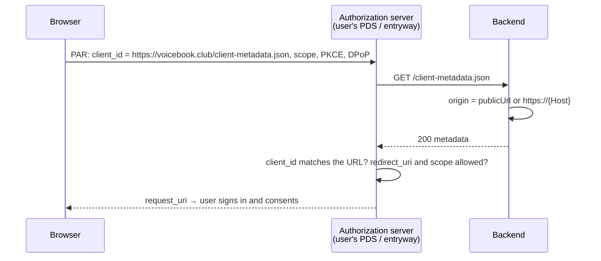

# `GET /client-metadata.json`

The OAuth client metadata document. For a deployed instance, its URL *is* the
OAuth client ID: when a user signs in, their PDS's authorization server
fetches this document to learn the app's name, redirect URI and requested
scopes.

Local development doesn't use it: on a loopback address (127.0.0.1) the
frontend is a loopback client, whose client ID encodes the same information.

- **Auth:** none (it's fetched by authorization servers).
- **Implemented in:** `client_metadata` in `backend/src/web.rs`.

## Response

`200 OK`, for an instance at `https://voicebook.club`:

```json
{
  "client_id": "https://voicebook.club/client-metadata.json",
  "client_name": "Voicebook",
  "client_uri": "https://voicebook.club",
  "redirect_uris": ["https://voicebook.club/"],
  "scope": "atproto repo:club.voicebook.recording blob:audio/* rpc:club.voicebook.auth.createSession?aud=*",
  "grant_types": ["authorization_code", "refresh_token"],
  "response_types": ["code"],
  "token_endpoint_auth_method": "none",
  "application_type": "web",
  "dpop_bound_access_tokens": true
}
```

- **Origin:** `publicUrl` from the config if set; otherwise
  `https://<Host>` from the request, so the proxy in front must pass `Host`
  through. A request whose `Host` is missing or malformed gets 400.
- **Scopes:** writing Voicebook records, uploading audio, and requesting
  service-auth tokens for signing in to this backend (`docs/design/auth.md`).
  Keep in sync with the loopback client's scope in `frontend/src/auth.ts`.
- `token_endpoint_auth_method: none`: a public client, with no secret.

## Errors

| Status | When |
|---|---|
| 400 | No `publicUrl` configured and no valid `Host` header |

## Sequence


