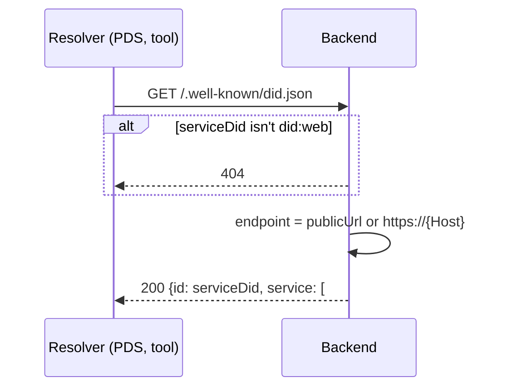

# `GET /.well-known/did.json`

This service's DID document, for a `did:web` service DID: `serviceDid` in the
config (e.g. `did:web:voicebook.club`). It names the `#voicebook` service that
service-auth tokens are addressed to (`<serviceDid>#voicebook`).

The backend verifies tokens itself and doesn't fetch this; it's here so the
service DID resolves the standard way, for PDSes and tools that check it.

- **Auth:** none.
- **Implemented in:** `did_document` in `backend/src/web.rs`.

## Response

`200 OK`, for `serviceDid = did:web:voicebook.club`:

```json
{
  "@context": ["https://www.w3.org/ns/did/v1"],
  "id": "did:web:voicebook.club",
  "service": [
    {
      "id": "#voicebook",
      "type": "VoicebookService",
      "serviceEndpoint": "https://voicebook.club"
    }
  ]
}
```

The endpoint is `publicUrl` if configured, otherwise `https://<Host>`.

## Errors

| Status | When |
|---|---|
| 404 | `serviceDid` isn't a `did:web` |
| 400 | No `publicUrl` configured and no valid `Host` header |

## Sequence


