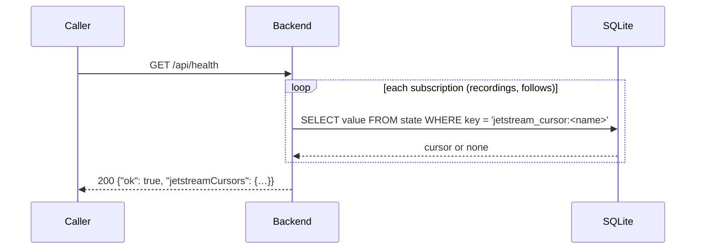

# `GET /api/health`

Liveness check: the process is up and its database answers. Also reports each
Jetstream subscription's stored cursor.

- **Auth:** none.
- **Used by:** orchestrators' health checks (App Platform `health_check`,
  Docker), and people.
- **Not traced or measured:** it's polled constantly, so it's outside the
  request-telemetry layers.

## Response

`200 OK`

```json
{
  "ok": true,
  "jetstreamCursors": { "recordings": 26716604418, "follows": 26716611023 }
}
```

A cursor is `null` until its subscription has saved one (a fresh database, or
no matching events yet).

## Errors

| Status | When |
|---|---|
| 500 | The database can't be read |

## Sequence


