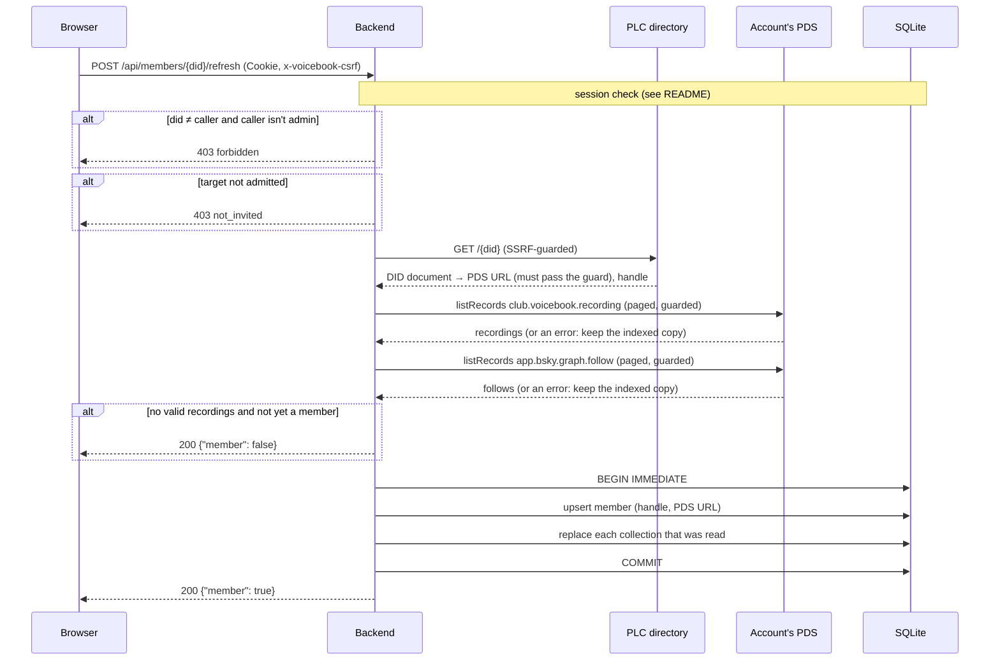

# `POST /api/members/{did}/refresh`

Re-reads an account's repository from its PDS right now, instead of waiting
for Jetstream. If the account has at least one well-formed recording it
becomes (or stays) a member, and its indexed recordings and follows are
replaced by what the PDS has.

The frontend calls it for the signed-in account after sign-in and after each
save, so a new member or a new recording shows up immediately.

- **Auth:** session; your own DID, or any DID if you're an admin;
  `x-voicebook-csrf: 1` required.
- **Implemented in:** `refresh_member` in `backend/src/api.rs`;
  `Indexer::refresh_member` in `backend/src/indexer.rs`.

## Request

```http
POST /api/members/did%3Aplc%3Awzraxbnzzz4fxt72jhvuswbb/refresh
Cookie: __Host-vb_session=…
x-voicebook-csrf: 1
```

## Response

`200 OK`

```json
{ "member": true }
```

`false` if the account has no recordings and wasn't a member: nothing is
stored.

Partial failures never lose indexed data:

- If the DID can't be resolved, the index is left as it was, and the answer
  says whether the account was already a member.
- If one collection can't be read (e.g. `listRecords` times out), that
  collection keeps its indexed copy; only collections read successfully are
  replaced. A successful, *empty* read does replace: the records were deleted.

## Errors

| Status | `error` | When |
|---|---|---|
| 400 | `expected a did:plc or did:web DID` | `{did}` isn't a DID |
| 401 | `not_signed_in` | No valid session |
| 403 | `missing CSRF header` | No `x-voicebook-csrf` header |
| 403 | `forbidden` | Someone else's DID, and the caller isn't an admin |
| 403 | `not_invited` | The caller's or the target's account isn't admitted |
| 500 | `internal error` | The index couldn't be written |

## Observability

- Log: `member refreshed` (did, recordings, follows) when stored.
- Metric: `member_refresh_duration_seconds`; outbound calls in
  `atproto_request_duration_seconds`.
- Trace: `refresh_member` → `fetch_snapshot` → `resolve`, `list_records` ×2,
  each with its HTTP request span.

## Sequence


