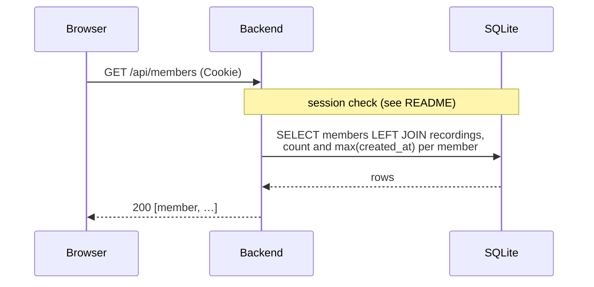

# `GET /api/members`

Lists every known Voicebook member (accounts with at least one recording),
with how many recordings each has and when they last practiced.

- **Auth:** session (any admitted account).
- **Implemented in:** `members` in `backend/src/api.rs`.

## Response

`200 OK`, sorted by handle:

```json
[
  {
    "did": "did:plc:wzraxbnzzz4fxt72jhvuswbb",
    "handle": "alice.test",
    "active": true,
    "recordingCount": 32,
    "lastPracticeAt": "2026-10-07T02:31:09.113Z"
  },
  {
    "did": "did:plc:3qrhneybizwlxs5ar3updfjq",
    "handle": "bob.test",
    "active": true,
    "recordingCount": 3,
    "lastPracticeAt": "2026-10-05T10:04:46.000Z"
  }
]
```

- `active` is false while the account is deactivated or taken down (from
  Jetstream account events); such members are left out of friends' activity.
- Members with no recordings left (all deleted) stay listed with a count of 0.

## Errors

| Status | `error` | When |
|---|---|---|
| 401 | `not_signed_in` | No valid session |
| 403 | `not_invited` | The caller's account isn't admitted |
| 500 | `internal error` | The database can't be read |

## Sequence


