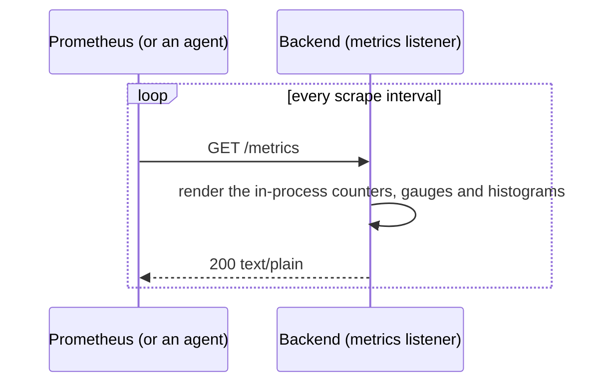

# `GET /metrics`

Prometheus metrics, in Prometheus's text format.

- **Where:** on its own listener when `metricsBind` is set (port 9100 in the
  container environments), which is never published or routed publicly. In
  development, without `metricsBind`, it's on the main port for the local
  Prometheus to scrape. On the main port of a deployed instance it returns
  404.
- **Auth:** none; keep the port private.
- **Not traced or measured itself.**
- **Implemented in:** `metrics` in `backend/src/api.rs`; the metrics are
  described in [`../design/logging.md`](../design/logging.md#metrics-prometheus).

## Response

`200 OK`, `text/plain`:

```text
# HELP jetstream_connected 1 while a subscription is connected
# TYPE jetstream_connected gauge
jetstream_connected{subscription="recordings"} 1
jetstream_connected{subscription="follows"} 1
# HELP index_members Known Voicebook members
# TYPE index_members gauge
index_members 3
# TYPE http_server_request_duration_seconds histogram
http_server_request_duration_seconds_bucket{method="GET",route="/api/members",status="200",le="0.005"} 12
…
```

## Sequence



Index sizes (`index_members`, `index_recordings`, `index_follows`) are
updated every 15 seconds by a background task, not per scrape.
