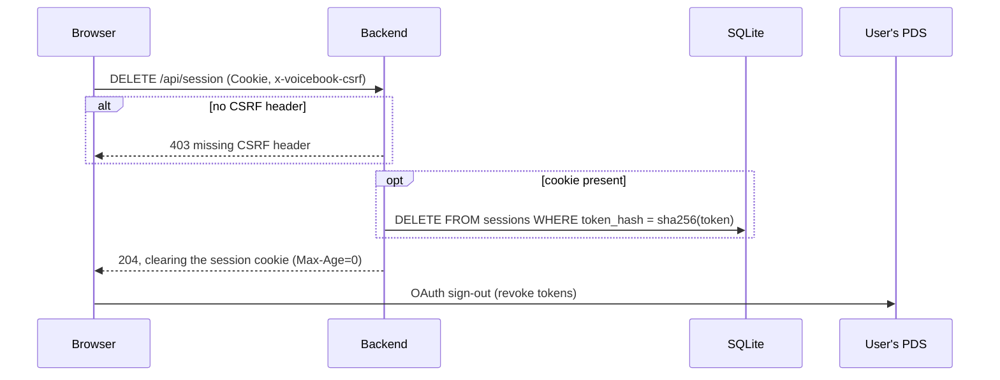

# `DELETE /api/session`

Signs out of the backend: deletes the session and clears the cookie. The
frontend also signs out of the user's PDS (OAuth) at the same time.

- **Auth:** the session cookie, if any; `x-voicebook-csrf: 1` required.
- **Idempotent:** without a cookie, or with an unknown one, it still succeeds
  and clears the cookie.
- **Implemented in:** `delete_session` in `backend/src/api.rs`.

## Request

```http
DELETE /api/session
Cookie: __Host-vb_session=…
x-voicebook-csrf: 1
```

## Response

`204 No Content`, clearing the cookie:

```http
Set-Cookie: __Host-vb_session=; Path=/; HttpOnly; SameSite=Strict; Max-Age=0; Secure
```

## Errors

| Status | `error` | When |
|---|---|---|
| 403 | `missing CSRF header` | No `x-voicebook-csrf` header |
| 500 | `internal error` | The session couldn't be deleted |

## Sequence


