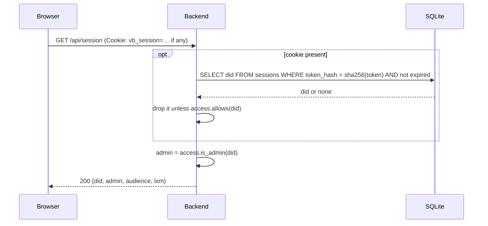

# `GET /api/session`

Who is signed in to the backend (if anyone), and what a service-auth token
must name to sign in. The frontend calls it after the OAuth sign-in to decide
whether it needs to create a session.

- **Auth:** none. If a `vb_session` cookie is sent, it's looked up.
- **Implemented in:** `get_session` in `backend/src/api.rs`.

## Response

`200 OK`, signed in:

```json
{
  "did": "did:plc:oq6rkprwln2i4rtv5gcignb6",
  "admin": true,
  "audience": "did:web:voicebook.club#voicebook",
  "lxm": "club.voicebook.auth.createSession"
}
```

Signed out (no cookie, an unknown or expired session, or an account no longer
admitted):

```json
{ "did": null, "admin": false, "audience": "did:web:voicebook.club#voicebook", "lxm": "club.voicebook.auth.createSession" }
```

- `audience` and `lxm` are what the frontend passes to
  `com.atproto.server.getServiceAuth` before `POST /api/session`.

## Errors

| Status | When |
|---|---|
| 500 | The database can't be read |

## Sequence


