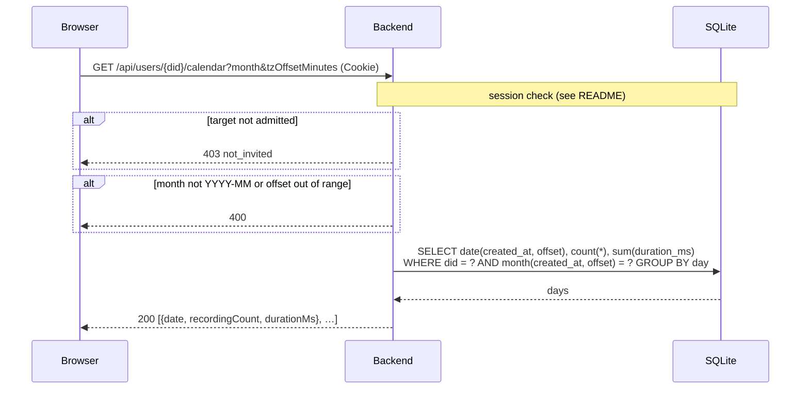

# `GET /api/users/{did}/calendar`

Practice days in one month, in the viewer's time zone: for each day with at
least one recording, how many recordings and how much audio. Powers the
Practice view's calendar.

- **Auth:** session; the account read must also be admitted.
- **Implemented in:** `calendar` in `backend/src/api.rs`.

## Request

```http
GET /api/users/did%3Aplc%3A3qrhneybizwlxs5ar3updfjq/calendar?month=2026-10&tzOffsetMinutes=-420
Cookie: __Host-vb_session=…
```

| Query | | |
|---|---|---|
| `month` | required | `YYYY-MM`, in the viewer's local time |
| `tzOffsetMinutes` | default 0 | The viewer's UTC offset in minutes (e.g. -420 for UTC-7); \|value\| ≤ 840. The frontend sends `-new Date().getTimezoneOffset()`. |

Timestamps are stored in UTC and shifted by the offset before grouping, so a
recording at 03:00 UTC on the 6th counts as the 5th for a viewer in UTC-7.

## Response

`200 OK`, one entry per practice day, ascending:

```json
[
  { "date": "2026-10-03", "recordingCount": 1, "durationMs": 4000 },
  { "date": "2026-10-04", "recordingCount": 1, "durationMs": 5000 },
  { "date": "2026-10-05", "recordingCount": 1, "durationMs": 6000 }
]
```

`durationMs` is null if none of the day's recordings recorded a duration.

## Errors

| Status | `error` | When |
|---|---|---|
| 400 | `expected month=YYYY-MM and \|tzOffsetMinutes\| <= 840` | Bad parameters |
| 401 | `not_signed_in` | No valid session |
| 403 | `not_invited` | The caller's or the target's account isn't admitted |
| 500 | `internal error` | The database can't be read |

A fixed offset is wrong across a daylight-saving change within a month; using
IANA time-zone names is an open decision (`docs/mvp-local.md` §22).

## Sequence


