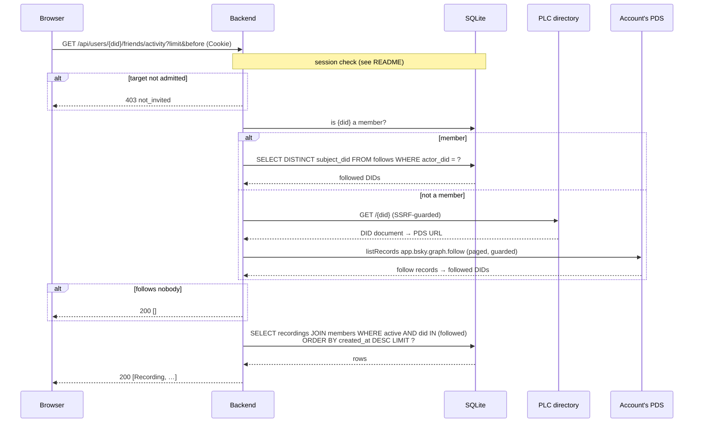

# `GET /api/users/{did}/friends/activity`

Recent recordings by the Voicebook members an account follows on Bluesky,
newest first. Powers the Friends view.

A "friend" is a known, active member whose DID appears in the account's
follows (`app.bsky.graph.follow` records).

- **Auth:** session; the account read must also be admitted.
- **Implemented in:** `friends_activity` in `backend/src/api.rs`;
  `Indexer::follows_of` in `backend/src/indexer.rs`.

## Request

```http
GET /api/users/did%3Aplc%3Awzraxbnzzz4fxt72jhvuswbb/friends/activity?limit=50
Cookie: vb_session=…
```

`limit` and `before` page as described in [Paging](README.md#paging).

## Response

`200 OK`: an array of [Recording](README.md#recording) objects from the
followed members, newest first. Empty if the account follows no members.

## Where the follows come from

- **The account is a member:** from the index, kept current by Jetstream and
  refreshes.
- **It isn't** (signed in, but no recordings yet): fetched live from its PDS
  on every request, through the SSRF guard.

## Errors

| Status | `error` | When |
|---|---|---|
| 401 | `not_signed_in` | No valid session |
| 403 | `not_invited` | The caller's or the target's account isn't admitted |
| 500 | `internal error` | The database can't be read, or the live follow fetch fails |

## Sequence


