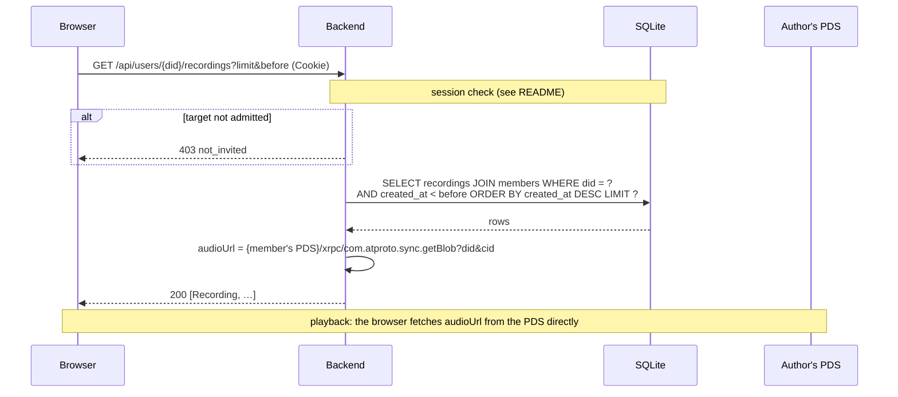

# `GET /api/users/{did}/recordings`

An account's recordings from the index, newest first. Powers the Recordings
view and the Practice view's day list.

- **Auth:** session; the account read must also be admitted.
- **Implemented in:** `recordings` in `backend/src/api.rs`.

## Request

```http
GET /api/users/did%3Aplc%3Awzraxbnzzz4fxt72jhvuswbb/recordings?limit=50&before=2026-10-05T00:00:00Z
Cookie: __Host-vb_session=…
```

| Query | Default | |
|---|---|---|
| `limit` | 50 | Clamped to 1–200 |
| `before` | none | RFC 3339 UTC; only recordings created strictly before it |

## Response

`200 OK`: an array of [Recording](README.md#recording) objects, newest
first. Empty if the account has no recordings or isn't a member.

## Errors

| Status | `error` | When |
|---|---|---|
| 401 | `not_signed_in` | No valid session |
| 403 | `not_invited` | The caller's or the target's account isn't admitted |
| 500 | `internal error` | The database can't be read |

## Sequence


